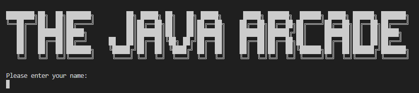
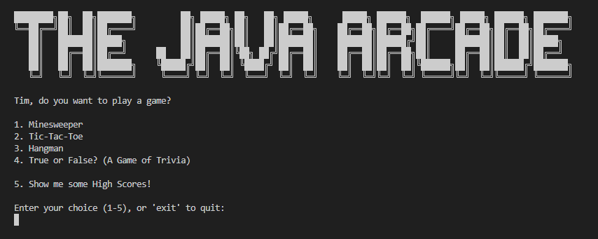
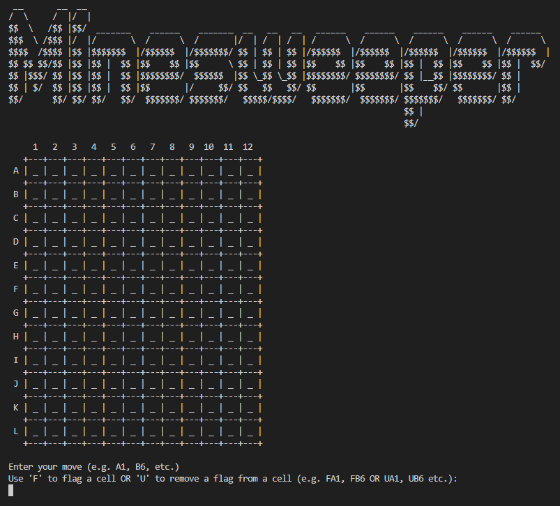
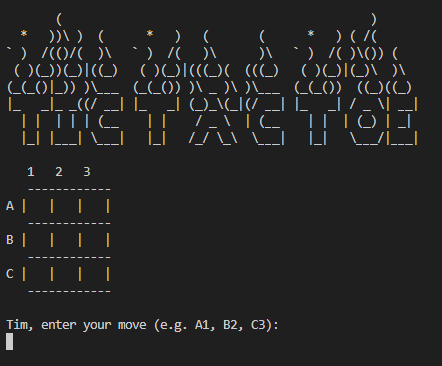
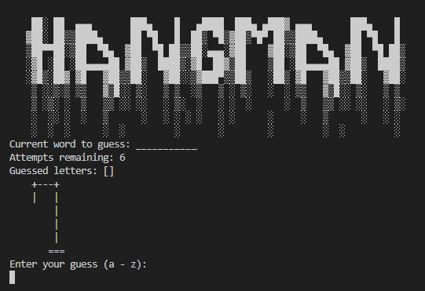
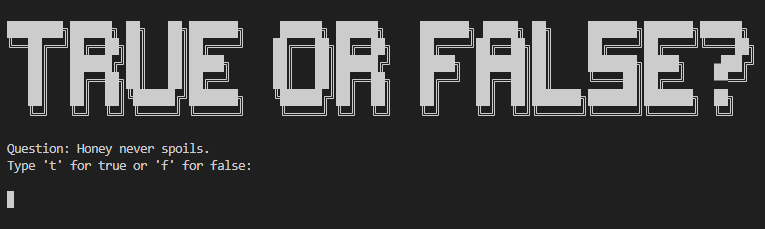

<h1> Welcome to: 

***
 The following games are available to play: 
***

## What did I use to create it?

This project uses:

-  Java

## Features of the Project:

-  Users are able to play a multitude of games and have their scores recorded.
-  Scores are carried over between games. 
-  Users are able to navigate seemlessly between games. 

<h1 style="font-weight: 900"> Here are some of the lessons I learnt:</h1>

### Using Java:

### The Convenience of Abstract classes and Interfaces:

-  From the beginning, I wanted to focus on using abstract classes and interfaces so that I would be able to become more familiar with them. As a result, I'm now a lot more comfortable using java and understand the importance of these tools

### Objects, classes and methods:

- Transitioning from a JavaScript-focused development environment, primarily using React, to Java required a different approach. It was in no way smooth but overall it was a very educational experience. Java has a strong emphasis on class-based object-oriented programming which had allowed me to delve deeper into the concepts of objects, classes, and methods. 

## What I want to include in the future:

## Have more functionality:

-   [ ] Include more games
-   [ ] Allow for a GUI (give the user a choice of CLI or GUI)
-   [ ] Introduce Multiplayer options

## Thank You!

Thank you for taking the time to look at this project. I really hope you enjoy it.
Feel free to reach out and ask any questions.

[Tim Broderick]
